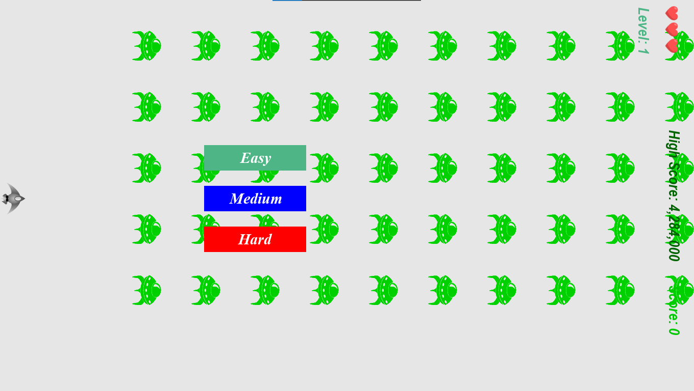
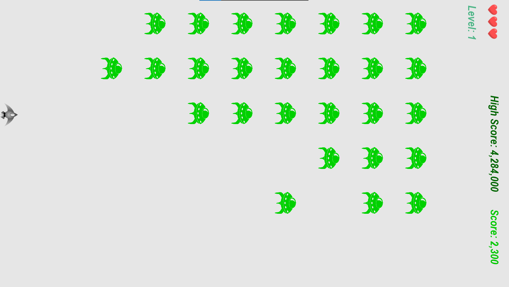

# 🚀 Musbi Sideways Shooter Game
A classic 2D arcade-style shooter built with Python and Pygame, where you control a spaceship that moves up and down while shooting aliens moving from right to left. The game includes sound effects, difficulty levels, score tracking, and a persistent high score system.

### 📁 Game Structure
File/Folder	Description

```images/```	Contains all image assets for the game

```sounds/```Contains all game sound effects

```alien.py```	Controls alien behavior

```bullet.py```	Manages the bullet logic

```button.py```	Handles the play/difficulty button interface

```life.py```	Tracks player lives

```ship.py```	Controls the spaceship’s movement and shooting

``settings.py``	Stores game settings and difficulty parameters

```game_stats.py```	Manages game statistics (lives, score, etc.)

```scoreboard.py```	Displays score, high score, and level

```sideways_shooter.py```	Main game file — starts the game

```high_score.txt```	Stores the highest score across sessions

### ✅ Requirements
Python 3.9 or higher
Pygame library

#### 🔗Download Python https://www.python.org/downloads/ 
📦 Install Pygame using: ```pip install pygame```

### 🎮 How to Play
#### Clone the repository:

```git clone https://github.com/Musbi8788/musbi_alien_invasion_game.git```

```cd musbi_alien_invasion_game```

#### Run the game:

```python alien_invasion.py```

##### Controls:

```Move Up: ↑ arrow key```

```Move Down: ↓ arrow key```

```Shoot: Spacebar```

### 🔥 Difficulty Levels
The game includes three main difficulty levels:

Level	Alien Points	Description
Easy	50 pts	Slower speed, easier waves
Medium	75 pts	Moderate speed, balanced gameplay
Hard	100 pts	Fast-paced, more aliens

### 💡 Each main difficulty contains sub-levels (Level 1, 2, etc.). As you progress, alien speed and game difficulty increase, along with the scoring potential.

###  🏆 High Score
The highest score is saved in high_score.txt, so you can always come back and try to beat your record.

### 📸 Screenshots 




## 🙌 Credits
Built by Musbi 
Inspired by the Alien Invasion project from the Python Crash Course book.